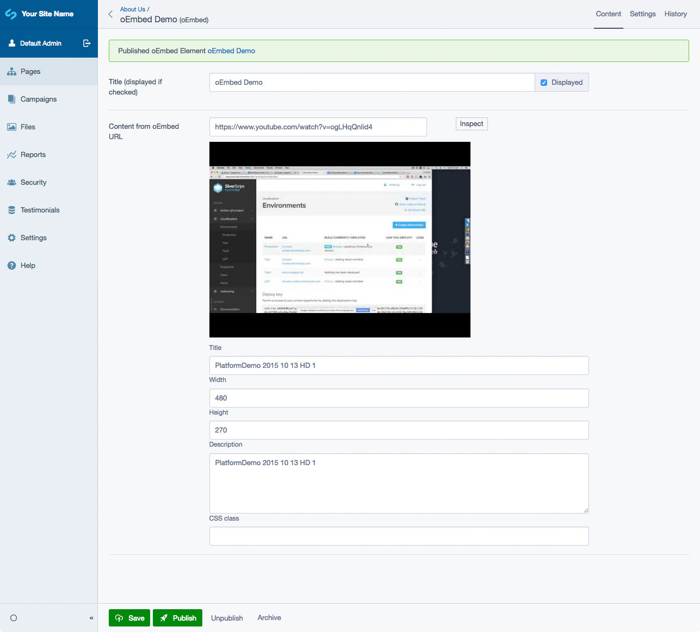

# Silverstripe Elemental Media Block

A content block to embed media from other websites via oEmbed

## Requirements

* dnadesign/silverstripe-elemental: ^4.8
* dynamic/silverstripe-linkable: ^1.0

## Installation

`composer require dynamic/silverstripe-elemental-oembed`

## Usage

Elemental oEmbed Block will add the following Element to your site:

* oEmbed (A block to embed media from other websites via oEmbed)

## Screen Shots

#### Front End sample of a oEmbed Element
The default templates are based off [Bootstrap 4](https://getbootstrap.com/) classes/styling

#### CMS - oEmbed Main Tab

## Getting more elements

See [Elemental modules by Dynamic](https://github.com/dynamic/silverstripe-elemental-blocks#getting-more-elements)

## Configuration

See [SilverStripe Elemental Configuration](https://github.com/dnadesign/silverstripe-elemental#configuration)

